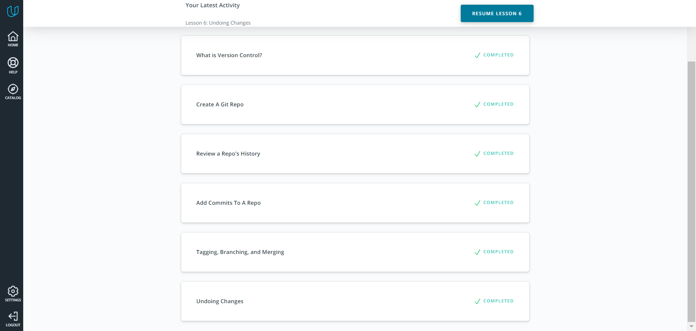
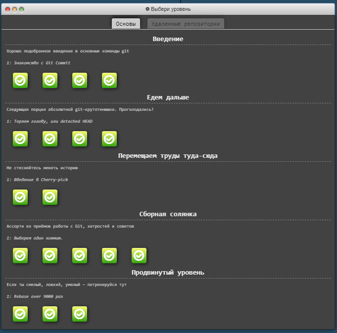
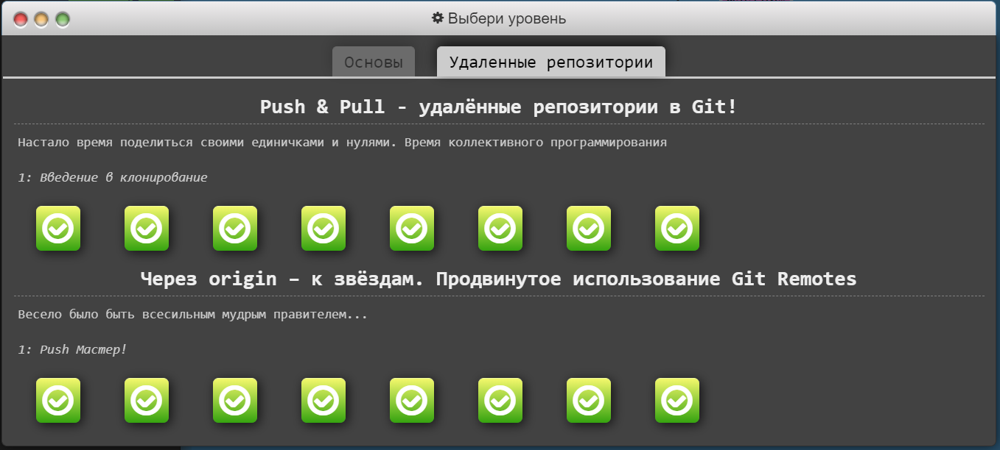

# kottans-frontend

### General

* Git Basics

## Git Basics

### Version Control with Git

Before I took this course, I had already had some basic knowledge about Git and knew a couple of commands. I realized that I was far away from undrestanding Git because most information in the course was new to me. Now I have greatly deepened my knowledge on this topic. I know how to create branches, switch between them, merge them, learned about different flags of `git log`, and much more. Moreover, I understood that a merge conflict isn't a catastrophe :D  
As a result, now I'm not limited to few commands.

Screenshot

### Learn Git Branching

This was challenging sometimes, but I managed to get through it :D  
I repeated newly learned commands and expanded my knowledge about new and existing commands.  
The most memorable command was `git cherry-pick` because of its name :D

Screenshots

---
