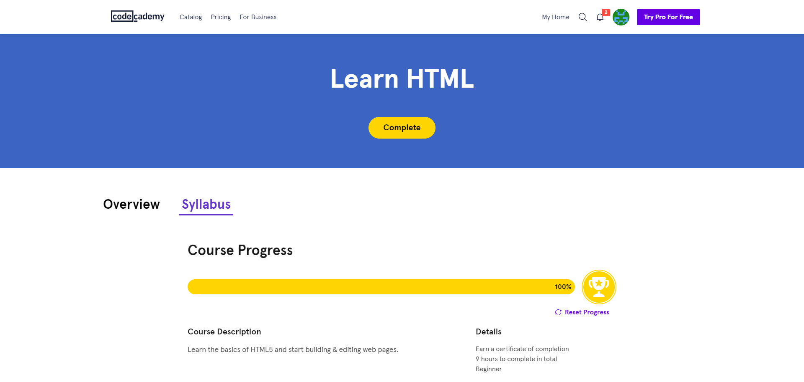

# kottans-frontend

### General

* [Git Basics](#git-basics)
* [Linux CLI, and HTTP](#linux-cli-and-http)
* [Git Collaboration](#git-collaboration)

### Front-End Basics

* [Intro to HTML and CSS](#intro-to-html-and-css)
* [Responsive Web Design](#responsive-web-design)

## Git Basics

### Version Control with Git

Before I took this course, I had already had some basic knowledge about Git and knew a couple of commands. I realized that I was far away from undrestanding Git because most information in the course was new to me. Now I have greatly deepened my knowledge on this topic. I know how to create branches, switch between them, merge them, learned about different flags of `git log`, and much more. Moreover, I understood that a merge conflict isn't a catastrophe :D  
As a result, now I'm not limited to few commands.

Screenshot

### Learn Git Branching

This was challenging sometimes, but I managed to get through it :D  
I repeated newly learned commands and expanded my knowledge about new and existing commands.  
The most memorable command was `git cherry-pick` because of its name :D

Screenshots

---

## Linux CLI, and HTTP

### Linux Survival

Most of the information was new to me, except commands like `cd` or `ls` because I have used them several times before.   
I plan to use commands `mkdir`, `rm`, `rmdir`, `mv` and `pwd` next time when I need to work with the command prompt.

Screenshots

### HTTP: The Protocol Every Web Developer Must Know

These articles weren't a piece of cake. Overall, now I have a clue what HTTP stands for and how client and server communicate. Also, I have discovered new status codes except 404, 403 and 500 that I have encountered before. I will definitely go back to them later on and search for additional information covered in these articles.

---

## Git Collaboration

This course was extremely helpful to me. Thanks to it, I managed to make my first pull request. Also, I have learned how to update my forked repository, make changes to my pull request, sort commits by authors. In addition, I have improved my knowledge about `git rebase -i`.

Screenshot

---

## Intro to HTML and CSS

These courses have helped me to refresh my knowledge about HTML and CSS. Most of the material wasn't new to me. Despite, I have almost forgotten how to make drop-down lists and datalists. Also, I have never worked with CSS Grid before, so the material about this topic was new to me.

Screenshots

---

## Responsive Web Design

### Responsive Web Design Fundamentals

The course on Udacity has introduced me for some aspects about responsiveness such as difference between hardware pixels and device independent pixels (DPI) , how to calculate viewport. Also, I've learned that tap targets should be 48 pixels in width and height and text should be 65 characters per line. I intend to follow these rules in my projects. The responsive patterns covered in the course were new to me. Besides, I refreshed my knowledge about media queries and flexbox.

Screenshot

### Flexbox flexbox_froggy

I have completed this game several times in the past, so this task didn't take much time to complete this time, but was still engaging. 

Screenshot

---
